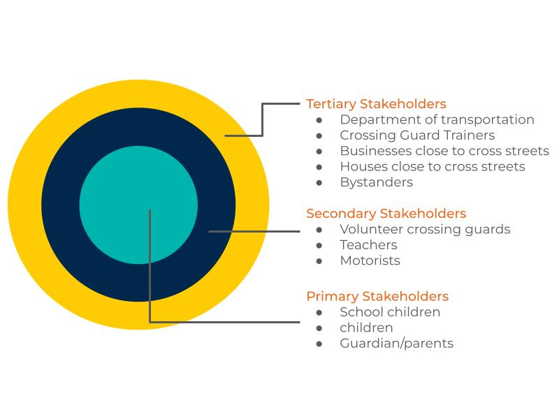
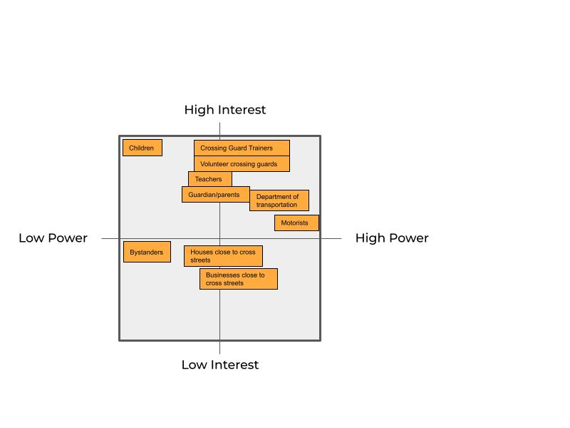
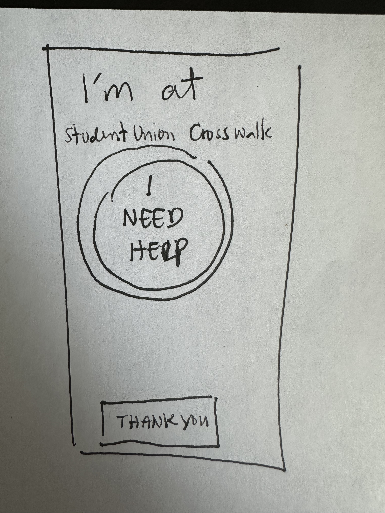
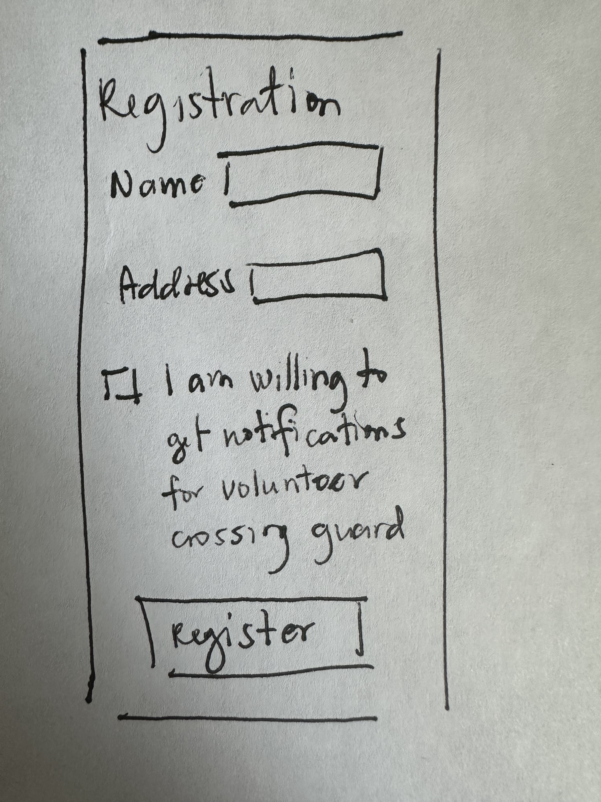
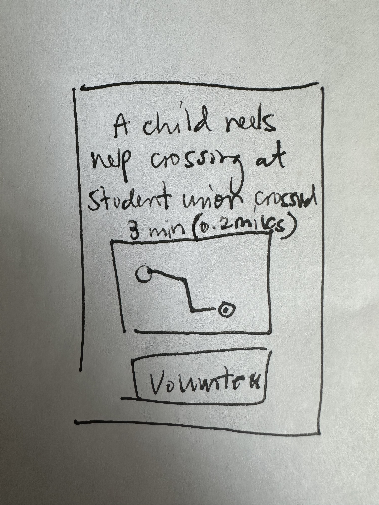
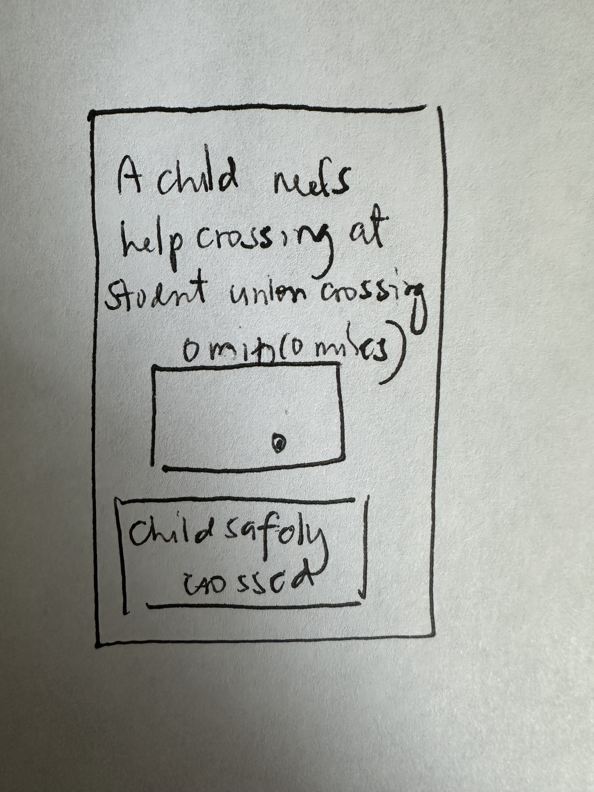
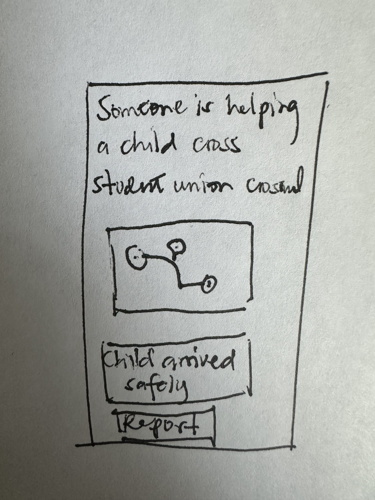

# Project Title
Safewalk

# Group Members
- Alex Chen
- Maya Patel
- Jordan Rivera

# Introduction
We see a lot of children crossing the street without adults guiding them. Several cars speed by and I’m afraid someone might get into an accident.

How might we make cross-streets safer for children?

# Stakeholder map
## Category 1: Resource Providers
1. Department of transportation
1. Volunteer crossing guards

## Category 2: Supporters & Beneficiaries of the Status Quo
1. Guardian/parents of school children
1. Teachers

## Category 3: Complementary Organizations and Allies
1. Crossing Guard Trainers

## Category 4: Beneficiaries and Customers
1. School children
1. Children

## Category 5: Opponents and Problem Makers
1. Motorists

## Category 6: Affected or Influential Bystanders
1. Businesses close to cross streets
1. Houses close to cross streets
1. Bystanders

## Onion Diagram

## Power Interest Diagram

# Requirements
1. Inexpensive
2. Information shared quickly
3. Easy to use - can be used by children or non-tech savvy bystanders.
4. Reliable and available.
5. Safe for children

# Specifications
1. The solution should have minimal to no cost to the user.
2. The user can share information in real-time.
3. The user should spend minimal to no time learning to use the system.
4. A child must be able to get help crossing any crosswalk anytime.
5. The system should adhere to privacy laws pertaining to children.
6. Only responsible adults should be alerted for children needing help to cross.

# Solution
Develop an application to find temporary crossing guards and report unguarded crosswalks.

# Features
1. Child crossing. A child should be able to launch the app and ask for help crossing without any complex actions (e.g., logins)
2. Registration. A responsible adult can register their name and address to the system to get notifications.
3. Child crossing alert - primary guard. Whenever a child asks for help crossing, it should alert at least three registered users around the vicinity. The primary crossing guard is asked to accompany the child and report when the child has crossed.
4. Child crossing alert - crossing guard verification. Alternate crossing guards are asked to verify if the child has crossed safely. This helps keep the child safe if a primary crossing guard has ill intentions.

# Code Contributions
## Alex Chen
### Structs / Classes
- `CrossingRequest`: Stores the child’s help request and location.
- `GuardMatcher`: Finds nearby registered adults and selects the best matches.

### Views
- `RequestHelpView`: Lets a child request help crossing with minimal steps.
- `GuardStatusView`: Shows the current help request status and assigned adults.

### How It Connects
- `RequestHelpView` creates `CrossingRequest` objects that Maya’s `NotificationDispatcher` uses to alert nearby adults.

## Maya Patel
### Structs / Classes
- `RegistrationProfile`: Stores a responsible adult’s name, address, and alert preferences.
- `NotificationDispatcher`: Sends crossing alerts to registered adults.

### Views
- `RegistrationView`: Collects adult registration information.
- `NotificationSettingsView`: Lets adults update alert preferences.

### How It Connects
- `RegistrationView` creates `RegistrationProfile` data that Alex’s `GuardMatcher` and `NotificationDispatcher` use to find and alert nearby adults.

## Jordan Rivera
### Structs / Classes
- `CrosswalkReport`: Records whether a child crossed safely and who confirmed it.
- `SafetyVerification`: Checks that backup guards confirm the crossing.

### Views
- `VerificationView`: Lets alternate guards confirm a safe crossing.
- `ReportView`: Displays the final crossing result and safety notes.

### How It Connects
- `VerificationView` uses Maya’s `NotificationDispatcher` to send verification updates and reads `CrosswalkReport` data generated after Alex’s `RequestHelpView` and `GuardMatcher` start the request flow.

# Prototypes
Child crossing

Registration

Child crossing alert - primary guard

Child crossing alert - crossing guard verification

